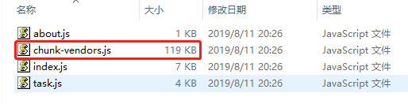
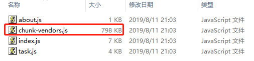
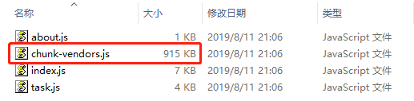
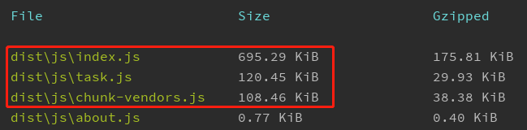

# vue-cli3多页打包

### 需求说明
在公司中经常接到运营活动的需求，这些活动有些还是比较复杂的，主要是逻辑比较复杂，
所以一般会选择使用vue来实现。活动做多了就会发现活动的一些UI样式和一些处理逻辑
是差不多的，像弹框、loading、处理错误逻辑、处理登录逻辑网络请求等都是一样的。
一个活动使用一个vue项目感觉有点繁琐，就像使用multi-page
模式将所有活动代码都写在一个vue项目里面，方便组件服用和代码管理

### 遇到的问题
多页打包的时候会将这个 页
不需要的依赖也打包进`chunk-vendors.js`文件中，造成js过大，加载比较慢。

``` javascript
// 简单的vue.config.js
module.exports = {
    devServer: {
        host: 'www.ddxg.com',
        port: 8066
    },
    productionSourceMap: false,
    pages: {
        index: {
            // page 的入口
            entry: 'src/pages/index/main.js',
            // 模板来源
            template: 'src/pages/index/index.html',
            // 在 dist/index.html 的输出
            filename: 'index.html',
            chunks: ['chunk-vendors', 'index']
        },
        task: {
            // page 的入口
            entry: 'src/pages/task/main.js',
            // 模板来源
            template: 'src/pages/task/index.html',
            // 在 dist/index.html 的输出
            filename: 'task.html',
            chunks: ['chunk-vendors', 'task']
        }
    },
    configureWebpack: {
        output: {
            filename: 'js/[name].js?hash=[hash]',
            chunkFilename: 'js/[name].js?hash=[chunkhash]',
        }
    },
    css: {
        extract: {
            filename: 'css/[name].css?hash=[contenthash]',
            chunkFilename: 'css/[name].css?hash=[contenthash]'
        },
    },
}
```

就是 A活动用到了一个第三方的插件，B活动没有用到，B活动加载的`chunk-vendors.js`文件中也包含那个插件，加载不需要的js

我这里有两个页面，`index`和`task`,下面是这两个页面基本没有引入第三方依赖时build后的`chunk-vendors.js`文件大小



`index`页面引入element-ui，的打包情况：



`index`页面引入element-ui，`task`引入mint-ui的打包情况：



> 观察可知，现有的打包机制会将src/pages/下面所有的html页面使用到的第三方依赖都打包到dist/js/chunk-vendor.js里面，
> 每个页面的js逻辑打到dist/js/xxx(页面的名字).js每个页面引入的是chunk-vendor.js和xxx(页面的名字).js。随着使用的第三方依赖越多，每个页面加载的`chunk-vendor.js`文件就越大，引入的多余代码就越多。

### 解决方法
**要做的改变是，将每个页面都引入的依赖打包到dist/js/chunk-vendor.js，将每个页面剩余的js打包到dist/js/xxx(页面的名字).js。**

``` javascript
// vue.config.js中添加如下配置
// 控制条件是minChunks字段，所以该字段的值是当前activity/src/projects里面的html的个数
chainWebpack: config => {
        config.optimization.splitChunks({
            cacheGroups: {
                vendors: {
                    name: 'chunk-vendors',
                    minChunks: 2,
                    chunks: 'initial'
                },
                common: {}
            }
        });
    }
```

得到的结果是：



各自页面中引入的依赖添加到了各自页面的js中，不会引入多余的不需要的依赖了。

具体内容请看webpack的配置：
[SplitChunksPlugin](https://webpack.js.org/plugins/split-chunks-plugin/)

webpack真的是好难啃啊，我不太能理解，先记录到这里，后面再完善webpack相关的配置的解释。

[我的相关代码](https://github.com/DDXG638/myLearn/tree/master/vue-project/vue-home)

### 参考
- [vue-cli3多页应用配置与优化](https://www.cnblogs.com/HYZhou2018/p/10419703.html)
- [config.optimization.splitChunk](https://blog.csdn.net/github_36487770/article/details/80228147)
- [webpack文档](https://webpack.js.org/plugins/split-chunks-plugin/)
